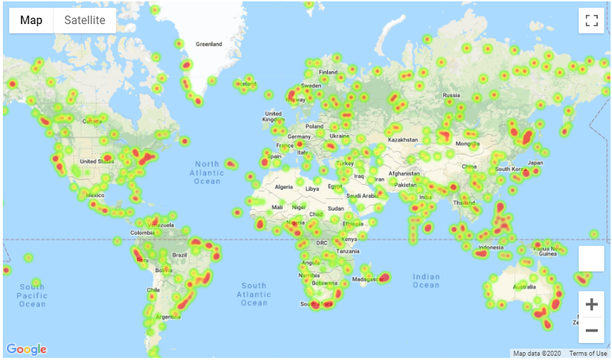
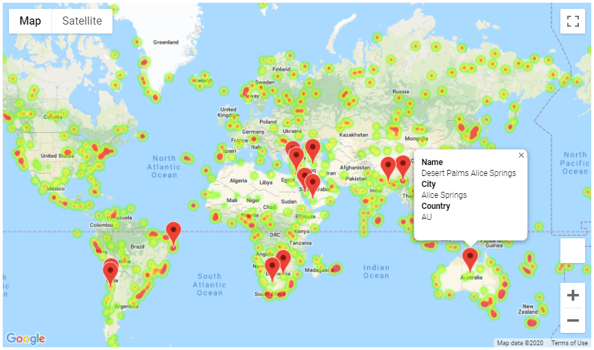

# Weather Data analysis and Finding Vacation City based on City Weather
---
## Weather Data Analysis
This analysis utilizes a [simple Python library](https://pypi.python.org/pypi/citipy), the [OpenWeatherMap API](https://openweathermap.org/api). Make sure you have an API Key from openweathermap website and save it in api_keys.py file in respective directory.

The weather analysis has been performed in notebook [WeatherPy](WeatherPy/WeatherPy.ipynb). It includes scatter plots for following pairs:
* Temperature (F) vs. Latitude
* Humidity (%) vs. Latitude
* Cloudiness (%) vs. Latitude
* Wind Speed (mph) vs. Latitude

After plotting the scatter plots, it further analyzes the relationship between following pairs of data, based on Linear Regression:
* Northern Hemisphere - Temperature (F) vs. Latitude
* Southern Hemisphere - Temperature (F) vs. Latitude
* Northern Hemisphere - Humidity (%) vs. Latitude
* Southern Hemisphere - Humidity (%) vs. Latitude
* Northern Hemisphere - Cloudiness (%) vs. Latitude
* Southern Hemisphere - Cloudiness (%) vs. Latitude
* Northern Hemisphere - Wind Speed (mph) vs. Latitude
* Southern Hemisphere - Wind Speed (mph) vs. Latitude

All charts are exported in png image format to [Output Data](output_data/) folder alongwith Weather data for each city in [Cities.csv](output_data/cities.csv) file.

---

## Vacation City Maps
This analysis utilizes the Google Maps API (gmaps) of Pandas. Make sure you have an API Key from Google and save it in api_keys.py file in respective directory.

The Vacation City analysis has been performed in notebook [VacationPy](VacationPy/VacationPy.ipynb). This notebook plots the Heatmap view on the Google Map to show relative Humidity across 500+ cities around the world. It is utilizing the [cities.csv](output_data/cities.csv) file data, exported in Weather Data Analysis.

The Vacation City list is identified based on following conditions:
* A max temperature lower than 80 degrees but higher than 70.
* Wind speed less than 10 mph.
* Zero cloudiness.

After identification of the Vacation City list, it updates the Google Heatmap plot with Hotel Markers for the Vacation Cities with each pin containing the **Hotel Name**, **City**, and **Country**.

---